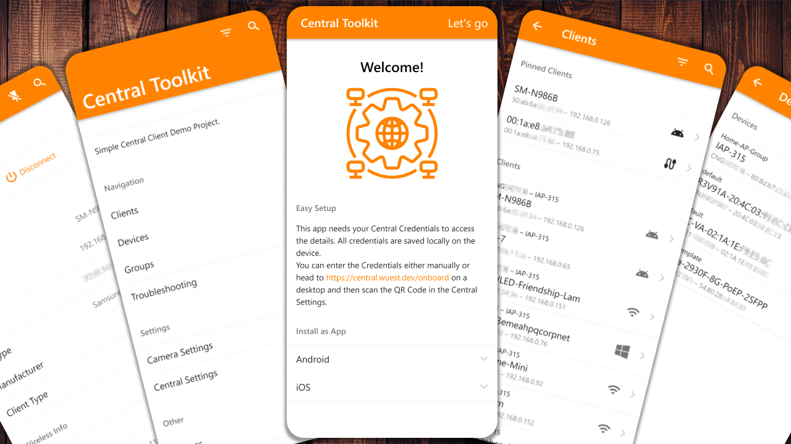
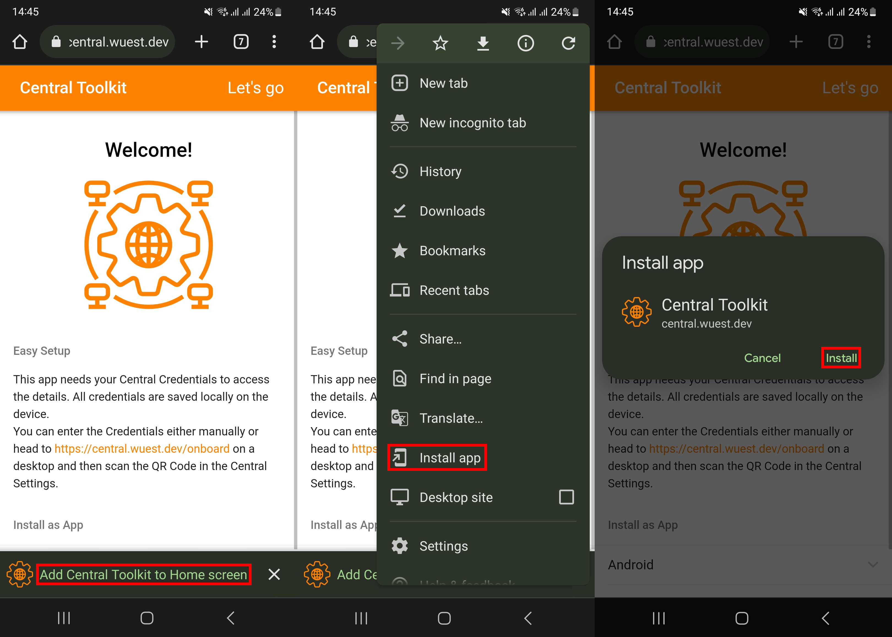
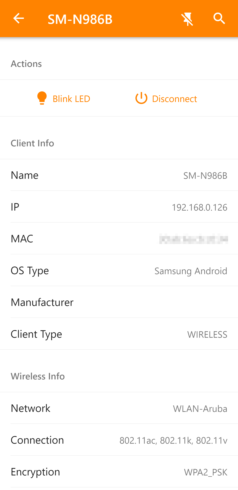
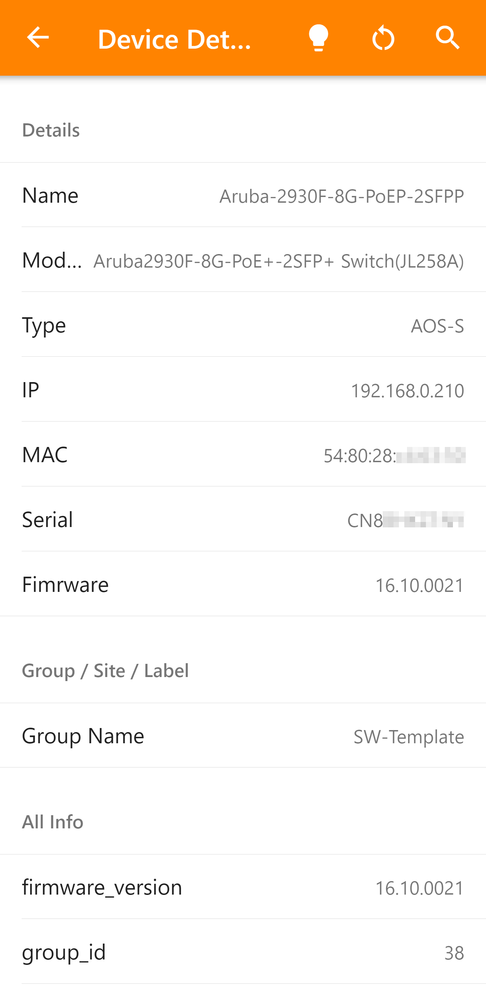
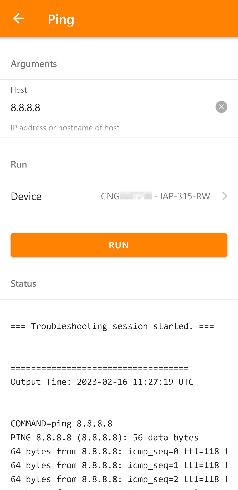

# Central Toolkit



## Install

To host this app it is best to use docker-compose. This builds the frontend and runs it together with the backend. **Please add an https reverse-proxy like Caddy to secure the communication.** The sevice is opened on port 26799.

``` sh
docker-compose up -d
```

To change caddy change these line in [`docker-compose.yml`](docker-compose.yml) and edit the [`Caddyfile`](Caddyfile). Change `central.wuest.dev` to your domain. Caddy will automatically get an SSL-Certificate from Let's Encrypt.

``` yaml
caddy:
  image: caddy:2-alpine
  restart: unless-stopped
  ports:
    - "80:80"
    - "443:443"
  volumes:
    - ./Caddyfile:/etc/caddy/Caddyfile
    - ./caddy_data:/data
    - ./caddy_config:/config
```

``` Caddyfile
central.wuest.dev {
  reverse_proxy http://mba-svelte:26799
}
```

## Add as an App

Go to your Domain or use the public version available on [https://central.wuest.dev](https://central.wuest.dev).

### iOS

Press on the **Share**-Button, scroll Down and click on **Add to Home Screen**. You can edit the name and then click on **Add** to add is an App.


### Android

Press on the **Add Central Toolkit to Home Screen** or select the options menu and click **Install app**. Then click **Install** in the dialog.



## Screenshots

There are also more screenshots [here](./screenshots/).

| Client&nbsp;Details | Device&nbsp;Details | Troubleshoot&nbsp; |
|:---:|:---:|:---:|
|  |  |  |
