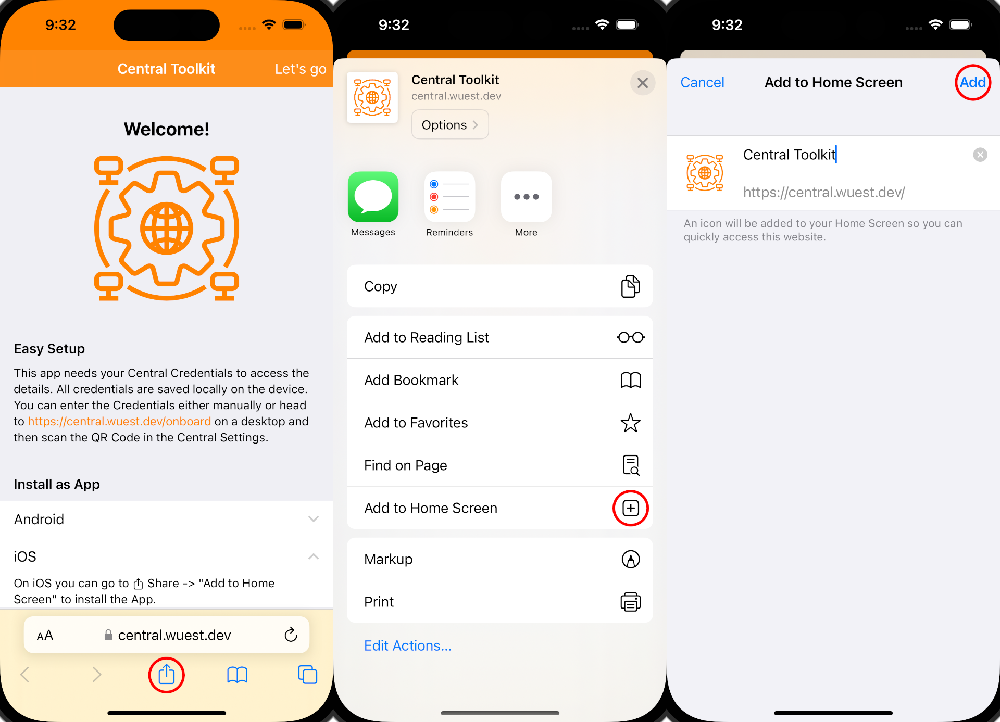

# Central Toolkit


## Install

To host this app it is best to use docker-compose. This builds the fronten and run it together with the backend.

``` sh
docker-compose up -d
```

## Add as an App

### iOS

Go to your Domain or use the public version available on [https://central.wuest.dev](https://central.wuest.dev).

Press on the **Share**-Button, scroll Down and click on **Add to Home Screen**. You can edit the name and then click on **Add** to add is an App.



## Screenshots

There are also more screenshots [here](./screenshots/).

| Client&nbsp;Details | Device&nbsp;Details | Troubleshoot&nbsp; |
|:---:|:---:|:---:|
|  |  |  |
